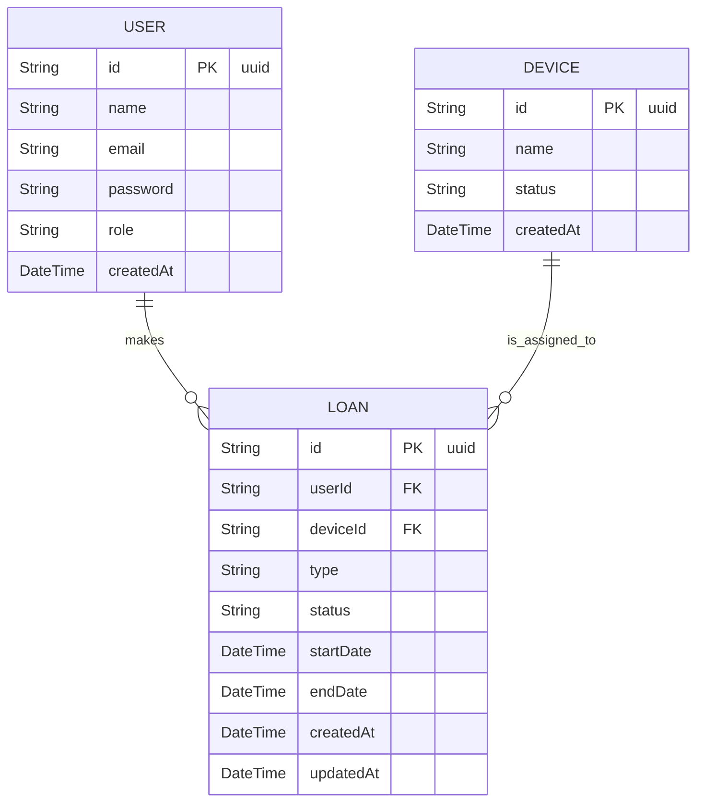

# ERD - Modelo de Datos (extraído de Prisma)

## Notas
- `User` y `Device` están en servicios distintos (loan-service y device-service respectivamente). Se hace referencia por `id` entre servicios.
- Indexes y validaciones están definidas en los `schema.prisma` de cada servicio.
