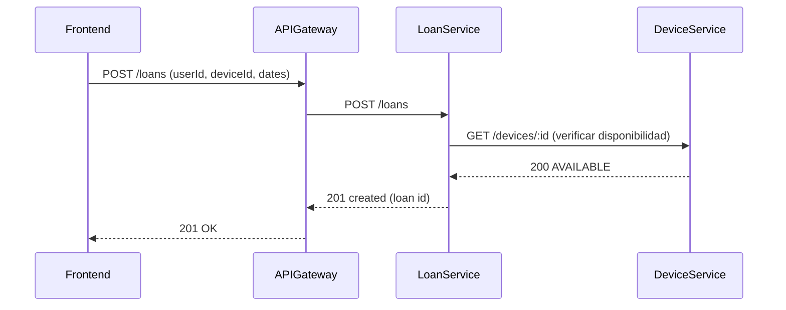
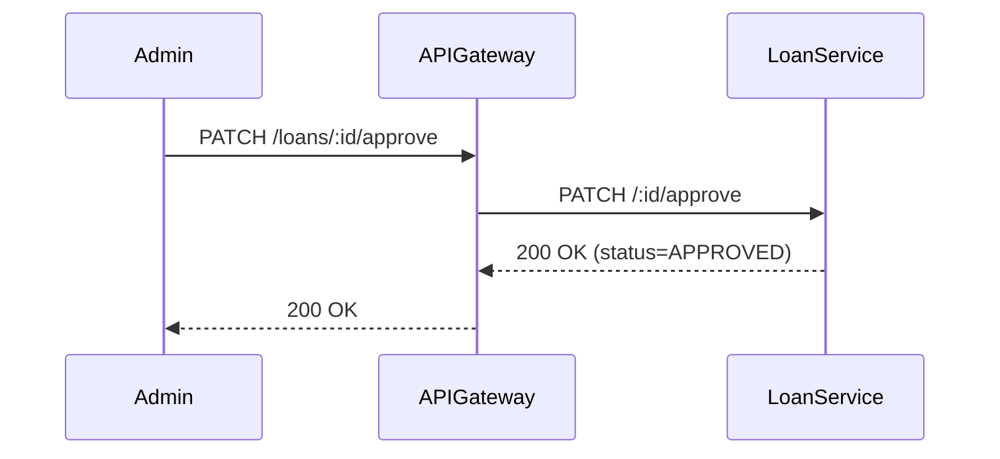
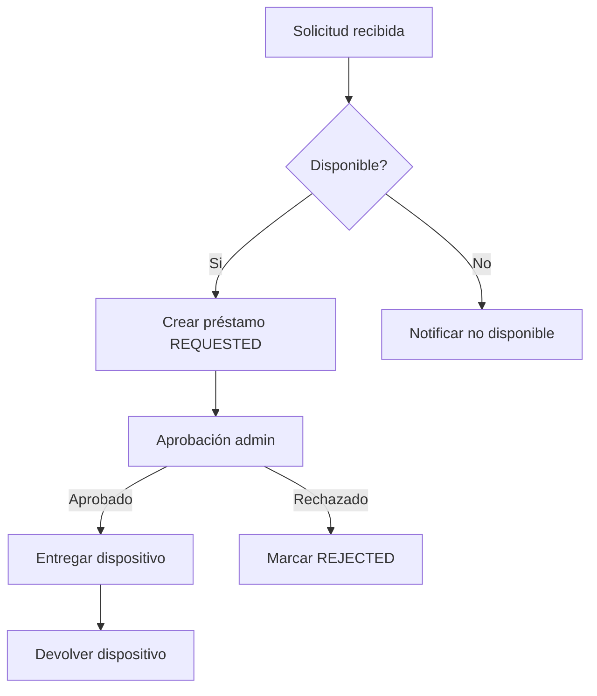
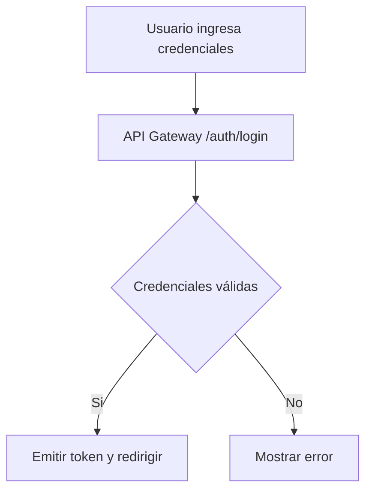

# Diagramas requeridos (plantillas)

## Secuencia: Solicitud de préstamo

## Secuencia: Aprobar préstamo

## Actividad: Flujo de préstamo (simplificado)

## Actividad: Manejo de autenticación (simplificado)

> Estos diagramas están como mermaid y pueden exportarse a PNG para la entrega. Puedes pedir que genere imágenes o archivos SVG si lo deseas.
